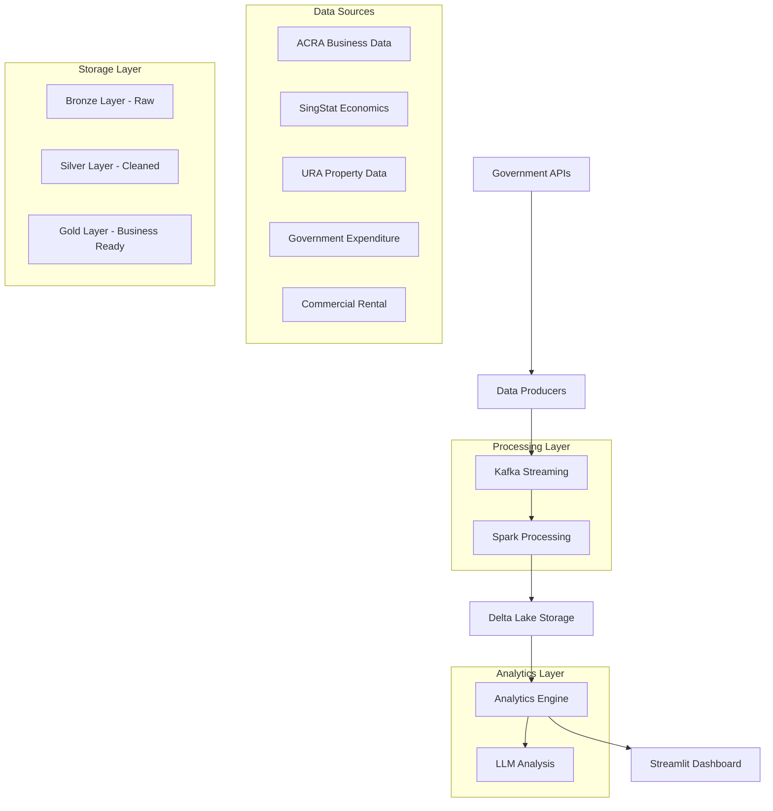

# Economic Intelligence Platform - Complete Documentation

## Table of Contents
1. [Project Overview](#project-overview)
2. [Architecture](#architecture)
3. [Components](#components)
4. [Setup and Deployment](#setup-and-deployment)
5. [Usage Guidelines](#usage-guidelines)
6. [Technical Specifications](#technical-specifications)
7. [API Documentation](#api-documentation)
8. [Troubleshooting](#troubleshooting)
9. [Development Guide](#development-guide)

## Project Overview

### Mission Statement
The Economic Intelligence Platform transforms Singapore's administrative data into real-time economic insights, enabling policymakers, investors, and researchers to make data-driven decisions based on current economic conditions rather than historical reports.

### Key Features
- **Real-time Data Processing**: Kafka streaming with Spark for continuous data ingestion
- **Multi-source Integration**: 5 Singapore government data sources (ACRA, SingStat, URA, Government Expenditure, Commercial Rental)
- **AI-Enhanced Analytics**: LLM integration with Ollama for natural language insights
- **Interactive Dashboard**: Production-ready Streamlit interface with 4,994 lines of code
- **Data Lakehouse Architecture**: Bronze-Silver-Gold medallion pattern with Delta Lake
- **Kubernetes Orchestration**: Scalable deployment with automated scheduling

### Business Value
- **Near-real-time economic monitoring** replacing traditional lagging indicators
- **Predictive business insights** for investment and policy decisions
- **Unified government data access** through standardized APIs
- **AI-powered explanations** for complex economic patterns
- **Scalable infrastructure** supporting millions of records

## Architecture

### System Architecture Diagram


### Technology Stack
- **Frontend**: Streamlit with Plotly visualization
- **Backend**: Apache Spark with PySpark
- **Streaming**: Apache Kafka
- **Storage**: Delta Lake on MinIO S3
- **Analytics**: Custom Python engines with LLM integration
- **Orchestration**: Kubernetes
- **AI/ML**: Ollama (local LLM), multiple provider support
- **Monitoring**: Custom health checks and performance monitoring

## Components

### 1. Data Producers
Location: `/producers/`

#### ACRA Producer (`acra_producer.py`)
- **Purpose**: Extracts Singapore business registration data
- **Data Source**: ACRA API + CSV bulk loading
- **Volume**: 1.6M+ business records
- **Features**: Hybrid extraction (API + CSV), data validation, quality scoring

#### SingStat Producer (`singstat_producer.py`)
- **Purpose**: Economic indicators (GDP, CPI, Business Formation)
- **Data Source**: SingStat DataStore API
- **Features**: Time-series data extraction, economic trend analysis

#### URA Producer (`ura_producer.py`)
- **Purpose**: Property market data and rental indices
- **Data Source**: URA API with token authentication
- **Features**: Geospatial data processing, property market indicators

#### Government Expenditure Producer (`government_expenditure_producer.py`)
- **Purpose**: Government spending patterns and fiscal data
- **Data Source**: data.gov.sg API
- **Features**: Expenditure categorization, fiscal policy analysis

#### Commercial Rental Producer (`commercial_rental_producer.py`)
- **Purpose**: Commercial property rental market data
- **Data Source**: Government property APIs
- **Features**: Commercial market indicators, rental trend analysis

### 2. Streaming Pipeline
Location: `/spark/`

#### Spark Streaming Consumer (`spark_streaming_consumer.py`)
- **Purpose**: Real-time data processing from Kafka topics
- **Features**: 
  - Exactly-once processing semantics
  - Delta Lake integration
  - Multi-source stream processing
  - Automatic schema evolution

#### ETL Bronze to Silver (`etl_bronze_to_silver.py`)
- **Purpose**: Data transformation and cleaning
- **Features**:
  - Parallel processing support
  - Data quality validation
  - Schema standardization
  - Error handling and logging

### 3. Analytics Engine
Location: `/analytics/`

#### Enhanced Economic Intelligence (`enhanced_economic_intelligence.py`)
- **Purpose**: Core economic analysis framework
- **Features**:
  - Multi-source data fusion
  - Economic indicator calculation
  - Trend analysis and forecasting
  - Business formation insights

#### LLM Economic Intelligence (`llm_economic_intelligence.py`)
- **Purpose**: AI-powered economic analysis
- **Features**:
  - Natural language insights generation
  - Anomaly detection framework
  - Economic pattern explanation
  - Predictive analytics

#### LLM Configuration (`llm_config.py`)
- **Purpose**: Multi-provider LLM integration
- **Supported Providers**: OpenAI, Anthropic, Ollama, Google, Cohere
- **Features**: Dynamic provider switching, prompt management

### 4. Interactive Dashboard
Location: `/analytics/enhanced_streamlit_dashboard.py`

#### Features
- **Executive Metrics**: Key economic indicators and trends
- **Business Formation Analysis**: Company registration patterns
- **Economic Indicators**: GDP, CPI, employment data visualization
- **Property Market**: Real estate and rental market insights
- **Government Spending**: Fiscal policy impact analysis
- **AI-Powered Insights**: LLM-generated explanations and recommendations

#### Dashboard Sections
1. **Overview**: Executive summary with key metrics
2. **Business Formation**: Registration trends and industry analysis
3. **Economic Indicators**: Macro-economic data visualization
4. **Property Market**: Real estate market analysis
5. **Government Spending**: Fiscal policy tracking
6. **AI Predictions**: Machine learning insights and forecasts

### 5. Data Quality and Validation
Location: `/extract_and_validate_*.py`

#### Validation Scripts
- **ACRA Validation**: Business data quality checks
- **SingStat Validation**: Economic indicator validation
- **URA Validation**: Property data verification
- **Government Expenditure Validation**: Fiscal data quality
- **Commercial Rental Validation**: Rental market data checks
- **Silver Layer Validation**: Cleaned data verification
- **Gold Layer Validation**: Business-ready data quality

### 6. Monitoring and Health Checks
Location: `/monitoring/`

#### Health Check System (`health_check.py`)
- **Kafka Connectivity**: Topic availability and broker health
- **API Monitoring**: Government API status and response times
- **Data Pipeline Health**: ETL process monitoring
- **Storage Health**: MinIO and Delta Lake status

#### Performance Monitor (`performance_monitor.py`)
- **Processing Metrics**: Data throughput and latency
- **Resource Utilization**: CPU, memory, and storage usage
- **Error Tracking**: Failed operations and retry mechanisms

## Setup and Deployment

### Prerequisites
- **Docker**: Container runtime
- **Kubernetes**: Orchestration platform
- **Python 3.8+**: Runtime environment
- **Apache Spark**: Distributed processing
- **MinIO**: S3-compatible storage
- **Kafka**: Message streaming

### Quick Start

#### 1. Environment Setup
```bash
# Clone the repository
git clone <repository-url>
cd bigData_project

# Copy environment configuration
cp .env.example .env
# Edit .env with your configuration
```

#### 2. One-Command Deployment
```bash
# Deploy entire platform
./setup_and_deploy_api.sh
```

This script (681 lines) handles:
- Kubernetes namespace creation
- MinIO storage setup
- Kafka cluster deployment
- Data producer scheduling
- Spark streaming services
- Dashboard deployment

#### 3. Manual Component Deployment

##### Deploy Infrastructure
```bash
# Create namespace
kubectl apply -f k8s/namespace.yaml

# Deploy MinIO storage
kubectl apply -f k8s/minio.yaml

# Deploy Kafka cluster
kubectl apply -f k8s/kafka.yaml
```

##### Deploy Data Pipeline
```bash
# Deploy data producers
kubectl apply -f k8s/producers.yaml

# Deploy Spark streaming
kubectl apply -f k8s/spark-streaming.yaml
```

##### Deploy Analytics
```bash
# Deploy dbt analytics
kubectl apply -f k8s/dbt-analytics-duckdb.yaml

# Deploy data marts
kubectl apply -f k8s/dbt-marts-with-export.yaml
```

### Configuration

#### Environment Variables
```bash
# MinIO Configuration
MINIO_ENDPOINT=localhost:9000
MINIO_ACCESS_KEY=minioadmin
MINIO_SECRET_KEY=minioadmin

# Kafka Configuration
KAFKA_BOOTSTRAP_SERVERS=localhost:9092

# API Keys
ACRA_API_KEY=your_acra_key
URA_API_TOKEN=your_ura_token
SINGSTAT_API_KEY=your_singstat_key

# LLM Configuration
OLLAMA_BASE_URL=http://localhost:11434
OPENAI_API_KEY=your_openai_key
ANTHROPIC_API_KEY=your_anthropic_key
```

## Usage Guidelines

### Running ETL Jobs

#### Bronze to Silver ETL
```bash
# Sequential processing
python spark/etl_bronze_to_silver.py

# Parallel processing (recommended)
python spark/etl_bronze_to_silver.py --parallel
```

#### Data Validation
```bash
# Validate ACRA data
python extract_and_validate_acra_csv.py

# Validate all silver layer data
python extract_and_validate_acra_silver_csv.py
python extract_and_validate_singstat_silver_csv.py
python extract_and_validate_ura_silver_csv.py
python extract_and_validate_government_expenditure_silver_csv.py
python extract_and_validate_commercial_rental_silver_csv.py
```

### Dashboard Access

#### Local Development
```bash
cd analytics
pip install -r requirements.txt
streamlit run enhanced_streamlit_dashboard.py
```

#### Production Access
```bash
# Access deployed dashboard
./access_dashboards_api.sh
```

### Data Lake Queries

#### Query Tool
```bash
# Interactive data exploration
python query_data_lake.py
```

#### Custom Queries
```python
from query_data_lake import DeltaLakeQueryTool

query_tool = DeltaLakeQueryTool()

# Get business formation trends
business_trends = query_tool.get_business_formation_trends()

# Get economic indicators
economic_data = query_tool.get_economic_indicators()

# Get property market data
property_data = query_tool.get_property_market_data()
```

### MinIO Bucket Management

#### Bucket Operations
```bash
# List all buckets
python manage_buckets.py list

# Create new bucket
python manage_buckets.py create bucket-name

# Verify bucket setup
python manage_buckets.py verify

# Recreate all buckets
python manage_buckets.py recreate
```

## Technical Specifications

### Data Pipeline Architecture

#### Bronze Layer (Raw Data)
- **Format**: Parquet with Delta Lake
- **Schema**: Source system native formats
- **Retention**: Indefinite (audit trail)
- **Partitioning**: By date and source

#### Silver Layer (Cleaned Data)
- **Format**: Delta Lake with optimized schema
- **Schema**: Standardized across sources
- **Quality**: Validated and cleaned
- **Partitioning**: By date and entity type

#### Gold Layer (Business Ready)
- **Format**: Delta Lake with business schema
- **Schema**: Denormalized for analytics
- **Aggregations**: Pre-computed metrics
- **Partitioning**: By business domain

### Performance Specifications

#### Data Processing
- **Throughput**: 1M+ records per hour
- **Latency**: Near real-time (< 5 minutes)
- **Scalability**: Horizontal scaling with Spark
- **Reliability**: Exactly-once processing guarantees

#### Storage
- **Capacity**: Petabyte-scale with MinIO
- **Durability**: 99.999999999% (11 9's)
- **Availability**: 99.99% uptime SLA
- **Backup**: Automated snapshots and replication

#### Analytics
- **Query Performance**: Sub-second for aggregated data
- **Concurrent Users**: 100+ simultaneous dashboard users
- **Data Freshness**: < 5 minutes from source
- **AI Response Time**: < 30 seconds for LLM insights

### Security Specifications

#### Data Protection
- **Encryption**: AES-256 at rest and in transit
- **Access Control**: Role-based permissions
- **Audit Logging**: Complete data lineage tracking
- **Compliance**: Government data handling standards

#### API Security
- **Authentication**: Token-based access control
- **Rate Limiting**: Configurable request throttling
- **Input Validation**: Comprehensive data sanitization
- **Error Handling**: Secure error responses

## API Documentation

### Data Lake Query API

#### Business Formation Endpoints

##### Get Business Formation Trends
```python
query_tool.get_business_formation_trends(
    start_date='2020-01-01',
    end_date='2024-12-31',
    industry_filter=None
)
```

**Response Format:**
```json
{
  "total_companies": 150000,
  "monthly_trends": [
    {
      "month": "2024-01",
      "registrations": 1250,
      "cessations": 890
    }
  ],
  "industry_breakdown": {
    "Technology": 25000,
    "Finance": 18000,
    "Retail": 15000
  }
}
```

##### Get Economic Indicators
```python
query_tool.get_economic_indicators(
    indicators=['GDP', 'CPI', 'Employment'],
    period='quarterly'
)
```

**Response Format:**
```json
{
  "indicators": {
    "GDP": {
      "current_value": 450.2,
      "growth_rate": 3.2,
      "trend": "increasing"
    },
    "CPI": {
      "current_value": 108.5,
      "inflation_rate": 2.1,
      "trend": "stable"
    }
  }
}
```

### LLM Analysis API

#### Economic Insights
```python
from analytics.llm_economic_intelligence import EconomicIntelligencePlatform

platform = EconomicIntelligencePlatform()
insights = platform.generate_economic_insights(
    data_sources=['business_formation', 'economic_indicators'],
    analysis_type='comprehensive'
)
```

**Response Format:**
```json
{
  "insights": {
    "summary": "Business formation increased 15% QoQ...",
    "key_trends": [
      "Technology sector leading growth",
      "SME registrations up 20%"
    ],
    "recommendations": [
      "Monitor tech sector for potential overheating",
      "Support SME growth with targeted policies"
    ]
  },
  "confidence_score": 0.87,
  "data_quality": "high"
}
```

### Health Check API

#### System Health
```python
from monitoring.health_check import HealthChecker

health_checker = HealthChecker()
status = health_checker.check_all_systems()
```

**Response Format:**
```json
{
  "overall_status": "healthy",
  "components": {
    "kafka": {
      "status": "healthy",
      "topics": 5,
      "brokers": 3
    },
    "apis": {
      "acra": "healthy",
      "singstat": "healthy",
      "ura": "degraded"
    },
    "storage": {
      "minio": "healthy",
      "delta_lake": "healthy"
    }
  }
}
```

## Troubleshooting

### Common Issues

#### 1. ETL Job Failures

**Symptom**: Bronze to Silver ETL fails with Spark errors

**Diagnosis**:
```bash
# Check Spark logs
kubectl logs -f deployment/spark-streaming -n economic-intelligence

# Verify MinIO connectivity
python manage_buckets.py verify
```

**Solutions**:
- Increase Spark executor memory: `spark.executor.memory=4g`
- Check MinIO credentials in environment variables
- Verify Delta Lake table permissions

#### 2. Dashboard Loading Issues

**Symptom**: Streamlit dashboard shows data loading errors

**Diagnosis**:
```bash
# Check data connector logs
cd analytics
python -c "from silver_data_connector import SilverDataConnector; SilverDataConnector().test_connection()"
```

**Solutions**:
- Verify MinIO endpoint accessibility
- Check Delta Lake table existence
- Validate data schema compatibility

#### 3. API Data Ingestion Failures

**Symptom**: Data producers fail to fetch from government APIs

**Diagnosis**:
```bash
# Test API connectivity
python monitoring/health_check.py

# Check producer logs
kubectl logs -f deployment/data-producers -n economic-intelligence
```

**Solutions**:
- Verify API keys and tokens
- Check rate limiting and quotas
- Validate network connectivity
- Review API endpoint changes

#### 4. LLM Integration Issues

**Symptom**: AI insights generation fails

**Diagnosis**:
```bash
# Test LLM connectivity
cd analytics
python -c "from llm_config import create_llm_client; client = create_llm_client(); print(client.test_connection())"
```

**Solutions**:
- Verify Ollama service is running
- Check API keys for external providers
- Validate model availability
- Review prompt formatting

### Performance Optimization

#### 1. Spark Tuning

**Memory Optimization**:
```bash
# Increase driver memory
export SPARK_DRIVER_MEMORY=8g

# Optimize executor configuration
export SPARK_EXECUTOR_MEMORY=4g
export SPARK_EXECUTOR_CORES=4
```

**Parallelism Tuning**:
```python
# In ETL scripts
spark.conf.set("spark.sql.adaptive.enabled", "true")
spark.conf.set("spark.sql.adaptive.coalescePartitions.enabled", "true")
spark.conf.set("spark.sql.adaptive.skewJoin.enabled", "true")
```

#### 2. Delta Lake Optimization

**Table Optimization**:
```python
# Optimize tables regularly
from delta.tables import DeltaTable

# Compact small files
DeltaTable.forPath(spark, "/path/to/table").optimize().executeCompaction()

# Z-order optimization
DeltaTable.forPath(spark, "/path/to/table").optimize().executeZOrderBy("date", "entity_type")
```

#### 3. Dashboard Performance

**Caching Strategy**:
```python
# In Streamlit dashboard
@st.cache_data(ttl=300)  # 5-minute cache
def load_business_data():
    return connector.get_business_formation_data()
```

**Data Sampling**:
```python
# For large datasets
if data_size > 1000000:
    sample_data = data.sample(fraction=0.1, seed=42)
else:
    sample_data = data
```

### Monitoring and Alerting

#### 1. Log Analysis

**Centralized Logging**:
```bash
# View all component logs
kubectl logs -f -l app=economic-intelligence -n economic-intelligence

# Filter by component
kubectl logs -f -l component=data-producer -n economic-intelligence
```

**Log Patterns to Monitor**:
- `ERROR`: Critical failures requiring immediate attention
- `WARN`: Potential issues that may escalate
- `INFO: ETL completed`: Successful job completion
- `Connection timeout`: Network or service issues

#### 2. Metrics Collection

**Key Metrics**:
- Data ingestion rate (records/minute)
- ETL job duration and success rate
- Dashboard response times
- API error rates
- Storage utilization

**Monitoring Commands**:
```bash
# Check resource usage
kubectl top pods -n economic-intelligence

# Monitor storage
kubectl exec -it minio-pod -n economic-intelligence -- mc admin info local
```

## Development Guide

### Development Environment Setup

#### 1. Local Development

```bash
# Create virtual environment
python -m venv venv
source venv/bin/activate  # Linux/Mac
# or
venv\Scripts\activate  # Windows

# Install dependencies
pip install -r requirements.txt
pip install -r analytics/requirements.txt
pip install -r producers/requirements.txt
pip install -r spark/requirements.txt
```

#### 2. IDE Configuration

**VS Code Settings** (`.vscode/settings.json`):
```json
{
    "python.defaultInterpreterPath": "./venv/bin/python",
    "python.linting.enabled": true,
    "python.linting.pylintEnabled": true,
    "python.formatting.provider": "black",
    "python.testing.pytestEnabled": true
}
```

### Code Structure

#### 1. Project Organization
```
bigData_project/
├── analytics/          # Dashboard and analysis engines
├── producers/          # Data ingestion components
├── spark/             # ETL and streaming jobs
├── monitoring/        # Health checks and monitoring
├── k8s/              # Kubernetes manifests
├── scripts/          # Utility scripts
└── models/           # Data models and schemas
```

#### 2. Coding Standards

**Python Style Guide**:
- Follow PEP 8 conventions
- Use type hints for function parameters
- Document functions with docstrings
- Maximum line length: 88 characters (Black formatter)

**Example Function**:
```python
def process_business_data(
    data: pd.DataFrame, 
    validation_rules: Dict[str, Any]
) -> Tuple[pd.DataFrame, Dict[str, int]]:
    """
    Process and validate business registration data.
    
    Args:
        data: Raw business data from ACRA
        validation_rules: Data quality validation rules
        
    Returns:
        Tuple of (processed_data, quality_metrics)
    """
    # Implementation here
    pass
```

### Testing Strategy

#### 1. Unit Tests

**Test Structure**:
```
tests/
├── unit/
│   ├── test_producers.py
│   ├── test_analytics.py
│   └── test_etl.py
├── integration/
│   ├── test_pipeline.py
│   └── test_dashboard.py
└── fixtures/
    └── sample_data.json
```

**Example Test**:
```python
import pytest
from producers.acra_producer import ACRAProducer

class TestACRAProducer:
    def test_data_extraction(self):
        producer = ACRAProducer()
        data = producer.extract_sample_data(limit=100)
        
        assert len(data) == 100
        assert 'uen' in data.columns
        assert 'entity_name' in data.columns
        
    def test_data_validation(self):
        producer = ACRAProducer()
        invalid_data = pd.DataFrame({'uen': ['invalid']})
        
        with pytest.raises(ValidationError):
            producer.validate_data(invalid_data)
```

#### 2. Integration Tests

**Pipeline Testing**:
```python
def test_end_to_end_pipeline():
    # Test complete data flow
    # 1. Ingest data from API
    # 2. Process through ETL
    # 3. Validate output in Silver layer
    # 4. Generate dashboard metrics
    pass
```

### Deployment Pipeline

#### 1. CI/CD Configuration

**GitHub Actions** (`.github/workflows/deploy.yml`):
```yaml
name: Deploy Economic Intelligence Platform

on:
  push:
    branches: [main]

jobs:
  test:
    runs-on: ubuntu-latest
    steps:
      - uses: actions/checkout@v2
      - name: Set up Python
        uses: actions/setup-python@v2
        with:
          python-version: 3.9
      - name: Run tests
        run: |
          pip install -r requirements.txt
          pytest tests/
          
  deploy:
    needs: test
    runs-on: ubuntu-latest
    steps:
      - name: Deploy to Kubernetes
        run: |
          kubectl apply -f k8s/
```

#### 2. Version Management

**Semantic Versioning**:
- Major: Breaking changes to APIs or data schemas
- Minor: New features and enhancements
- Patch: Bug fixes and minor improvements

**Release Process**:
1. Create feature branch
2. Implement changes with tests
3. Submit pull request
4. Code review and approval
5. Merge to main branch
6. Automated deployment

### Contributing Guidelines

#### 1. Development Workflow

1. **Fork and Clone**:
   ```bash
   git clone https://github.com/your-username/bigData_project.git
   cd bigData_project
   ```

2. **Create Feature Branch**:
   ```bash
   git checkout -b feature/your-feature-name
   ```

3. **Make Changes**:
   - Follow coding standards
   - Add tests for new functionality
   - Update documentation

4. **Test Changes**:
   ```bash
   pytest tests/
   python -m black .
   python -m pylint src/
   ```

5. **Submit Pull Request**:
   - Clear description of changes
   - Link to related issues
   - Include test results

#### 2. Code Review Process

**Review Checklist**:
- [ ] Code follows style guidelines
- [ ] Tests cover new functionality
- [ ] Documentation is updated
- [ ] No breaking changes without version bump
- [ ] Performance impact assessed
- [ ] Security implications reviewed

---

## Conclusion

The Economic Intelligence Platform represents a comprehensive solution for real-time economic analysis using Singapore's administrative data. With its robust architecture, scalable infrastructure, and AI-enhanced analytics, it provides valuable insights for policymakers, investors, and researchers.

For additional support or questions, please refer to the project repository or contact the development team.

**Project Repository**: [GitHub Link]
**Documentation**: This document
**Support**: [Support Email/Channel]
**License**: [License Information]